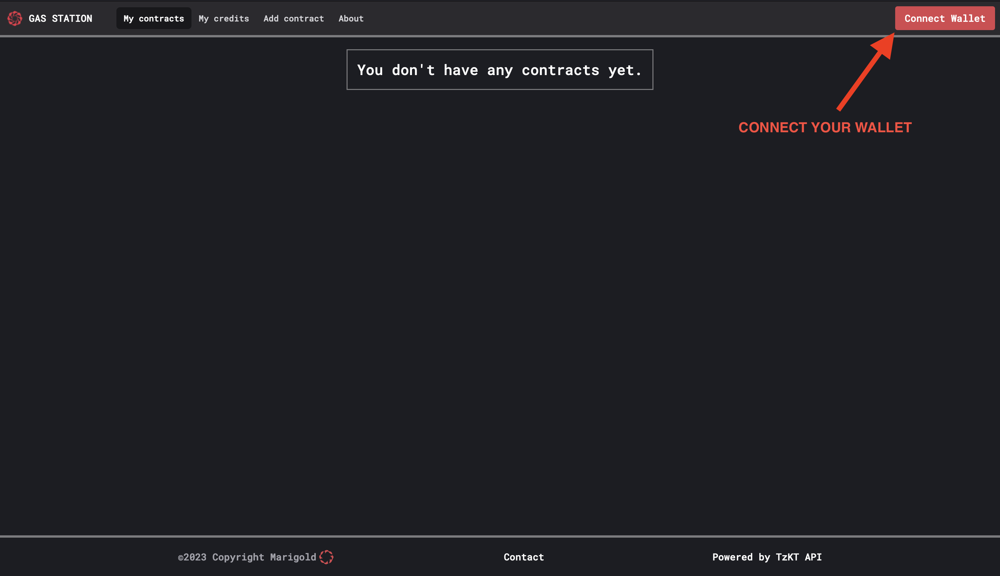

# Gas Station Webapp

The Gas Station webapp allows developers to manage sponsored contracts and operations as well as
their budget. It also allows to express basic conditions on the spending of credits, for instance by
giving a maximum budget per day.

The webapp is hosted by Marigold: [Gas Station webapp on Ghostnet](https://ghostnet.gas-station.marigold.dev/).

⚠️ Note: currently available only on Ghostnet ⚠️

## Usage

### Wallet connection

Like all dApps, one of the first things to do is connect your wallet by clicking on the button in the top right corner.

### Your contracts

The homepage lists all the contracts registered in the Gas Station as well as their entrypoints.
Entrypoints can be activated or deactivated, depending on if the operations targeting those entrypoints
should be sponsored or not.

### Add a new contract

To add a new contract, click on `Add contract` and fill in the required information. Start by entering the contract address to retrieve the associated entrypoints for your contract. Then, name the contract and activate the entrypoints which you want to sponsor.

### Add credits to your vault

The Gas Station sponsors operations to your contracts using the tez you have put in a vault. To add credits to your vault, go to the `My credits` page. Enter the amount of tez you want to send and confirm. After a few seconds, your vault balance and overall balance will be updated.

### Withdraw credits

You can also withdraw tez from your vault. On the `My credits` page, enter the amount of tez you want to withdraw and confirm. For security reasons, we require a signature which depends on the vault, the amount, and a withdraw counter which is stored in the database.

### Test

Once the contract is added and credits are transferred to your vault, you can integrate the Gas Station into your dApps by following this [guide](./tutorial.md). This will allow you to test the seamless integration of the Gas Station with your dApps.
