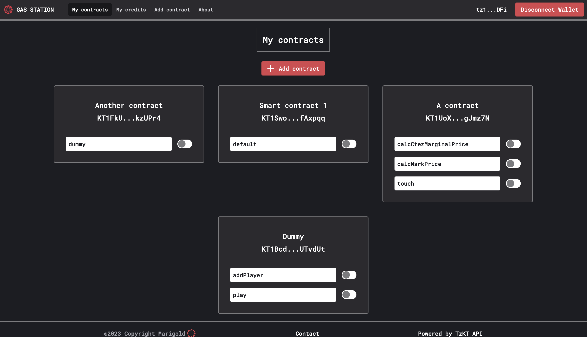

# Gas Station Webapp

To enhance the user experience with the Gas Station, particularly in interacting with contracts and managing the budget for fee payments, we have developed a web app, available [here](https://ghostnet.gas-station.marigold.dev/).

⚠️ Note: currently available only on Ghostnet ⚠️

## Usage

### Wallet connection

Like all dApps, one of the first things to do is connect your wallet by clicking on the button in the top right corner.

### Your contracts

On the homepage, you can find all your contracts registered on the Gas Station along with their activated entrypoints.

### Add a new contract

To add a new contract, click on `Add contract` and fill in the required information. Start by entering the contract address to retrieve the associated entrypoints for your contract. Then, provide a name and activate the entrypoints for which you want to sponsor.

### Add credits to your vault

To add credits to your vault, go to the `My credits` page. Enter the amount of XTZ you want to send to your vault and confirm. After a few seconds, your vault balance and overall balance will update, and the transfer will be effective.

### Withdraw

You can also withdraw XTZ from your vault. On the `My credits` page, enter the amount of XTZ you want to withdraw and confirm. You'll need to sign the transaction with your wallet to ensure that the credits go to the correct address.

### Test

Once the contract is added and credits are transferred to your vault, you can integrate the Gas Station into your dApps by following this [guide](./tutorial.md). This will allow you to test the seamless integration of the Gas Station with your dApps.